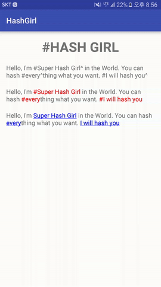

# #HashGirl

[](http://developer.android.com/index.html)
[](https://android-arsenal.com/api?level=7)
[](http://opensource.org/licenses/MIT)

HashGirl is a simple library to make a linkable string for Android. HashGirl can make hash a string which contains spaces. You can set regular expression to grap link and also you can set character to indicate the end of link. 



HashGirl uses method chain to make linkable string like below:

```java
String text = "Hello, I'm #Super Hash Girl^ in the World. You can hash #every^thing what you want. #I will hash you^";

TextView hashedTextView = (TextView)findViewById(R.id. hashedTextView);
HashGirl
        .with(text)
        .grap("(#((\\w+ *)*)\\^)", "^", "#")
        .underline()
        .color(Color.BLUE)
        .bgcolor(Color.WHITE)
        .click(new OnURLClickListener() {
            @Override
            public void onClickURL(String url) {
                Toast.makeText(MainActivity.this, url, Toast.LENGTH_SHORT).show();
            }
        })
        .into(hashedTextView);
```

## Setup Gradle

```gradle
dependencies {
    ...
    compile 'kr.pe.burt.android.lib:hashgirl:1.0.0'
}
```

## HashGirl's methods

* with(String text)
	* is static method to set the text data.
	* You should start HashGirl from this 'with' method.
* grap(String regExp)
* grap(String regExp, String postfixToRemove = "", String prefixToRemove = "")
	* set regular expression to grap linkable string
	* set postfixToRemove or prefixToRemove to remove indicator of the start or end of the linked string.
* underline()
	* to underline linked string
* strike()
	* to strike line through the string   
* color(int color)
	* set foreground color of the linked string
* bgcolor(int color)
	* set background color of the linked string
* alpha(int alpha)
	* set alpha of the linked string
* clikc(OnURLClickListener onURLClickListener)
	* set a handler to process the click action of the linked string
* into(TextView textVieW)
	* set a TextView to set the result.   

## Examples

```java
String text = "Hello, I'm #Super Hash Girl^ in the World. You can hash #every^thing what you want. #I will hash you^";

TextView before = (TextView)findViewById(R.id.before);
before.setText(text);

TextView after1 = (TextView)findViewById(R.id.after1);
HashGirl
    .with(text)
    .grap("(#((\\w+ *)*)\\^)", "^")		// remove postfix
    .click(new OnURLClickListener() {
        @Override
        public void onClickURL(String url) {
            Toast.makeText(MainActivity.this, url, Toast.LENGTH_SHORT).show();
        }
    })
    .into(after1);

TextView after2 = (TextView)findViewById(R.id.after2);
HashGirl
        .with(text)
        .grap("(#((\\w+ *)*)\\^)", "^", "#") // remove postfix and postfix
        .underline()
        .color(Color.BLUE)
        .bgcolor(Color.WHITE)
        .click(new OnURLClickListener() {
            @Override
            public void onClickURL(String url) {
                Toast.makeText(MainActivity.this, url, Toast.LENGTH_SHORT).show();
            }
        })
        .into(after2);
```

## MIT License

The MIT License (MIT)

Copyright (c) 2016 Sungcheol Kim, [https://github.com/skyfe79/HashGirl](https://github.com/skyfe79/HashGirl)

Permission is hereby granted, free of charge, to any person obtaining a copy
of this software and associated documentation files (the "Software"), to deal
in the Software without restriction, including without limitation the rights
to use, copy, modify, merge, publish, distribute, sublicense, and/or sell
copies of the Software, and to permit persons to whom the Software is
furnished to do so, subject to the following conditions:

The above copyright notice and this permission notice shall be included in all
copies or substantial portions of the Software.

THE SOFTWARE IS PROVIDED "AS IS", WITHOUT WARRANTY OF ANY KIND, EXPRESS OR
IMPLIED, INCLUDING BUT NOT LIMITED TO THE WARRANTIES OF MERCHANTABILITY,
FITNESS FOR A PARTICULAR PURPOSE AND NONINFRINGEMENT. IN NO EVENT SHALL THE
AUTHORS OR COPYRIGHT HOLDERS BE LIABLE FOR ANY CLAIM, DAMAGES OR OTHER
LIABILITY, WHETHER IN AN ACTION OF CONTRACT, TORT OR OTHERWISE, ARISING FROM,
OUT OF OR IN CONNECTION WITH THE SOFTWARE OR THE USE OR OTHER DEALINGS IN THE
SOFTWARE.
